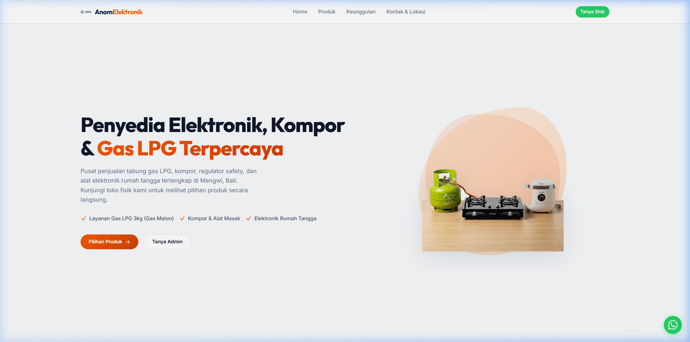

# Anom Elektronik & Gas Landing Page

Landing page modern, responsif, dan interaktif untuk Anom Elektronik & Gas, penyedia tabung gas LPG, kompor gas, regulator safety, dan alat-alat elektronik rumah tangga yang berlokasi di Mengwi, Bali.



## Tech Stack

*   **Core Framework**: Vue 3 (Composition API, Single File Components)
*   **Styling**: Tailwind CSS v4 (Desain modern dan responsif)
*   **Build Tool**: Vite
*   **Animations**: Custom CSS Transitions & Keyframes terintegrasi dengan Intersection Observer API untuk efek entrance scroll-triggered.

## Fitur Utama

*   **Hero Section Full-Fold**: Tampilan pembuka yang bersih dan pas dengan viewport layar pengguna untuk memfokuskan perhatian pada branding utama.
*   **Desain Kontainer Lebar**: Layout modern yang dioptimalkan untuk monitor layar lebar (max-width: 1650px).
*   **Animasi Scroll Bertahap (Staggered)**: Animasi transisi yang muncul saat halaman di-scroll ke bawah dan me-reset secara otomatis ketika di-scroll kembali ke atas.
*   **Katalog Kategori Produk**: Menampilkan kategori barang yang disediakan (Tabung Gas LPG, Kompor & Regulator, Elektronik Dapur, Kipas Angin, dan Elektronik Rumah Tangga).
*   **Formulir Hubungi Kami**: Memudahkan pelanggan mengirim pertanyaan langsung serta dilengkapi peta lokasi fisik toko.

## Struktur Project

*   `src/components/Hero.vue` - Area Hero pembuka dengan teks utama dan gambar ilustrasi produk.
*   `src/components/Features.vue` - Bagian keunggulan toko (Mengapa Memilih Kami).
*   `src/components/Catalog.vue` - Kategori produk dan daftar barang yang disediakan.
*   `src/components/Testimonials.vue` - Ulasan dari pelanggan.
*   `src/components/Faqs.vue` - Daftar tanya jawab seputar produk dan layanan.
*   `src/components/AboutContact.vue` - Informasi kontak, jam operasional, formulir pesan, dan lokasi Google Maps.

## Cara Menjalankan Project

### Prasyarat
*   **Node.js** (Versi 18 ke atas)

### Langkah Pemasangan

1.  Masuk ke direktori proyek:
    ```bash
    cd d:\laragon\www\landingpage
    ```
2.  Pasang semua dependensi proyek:
    ```bash
    npm install
    ```
3.  Jalankan server pengembangan lokal:
    ```bash
    npm run dev
    ```
4.  Buka browser Anda dan akses tautan lokal yang disediakan (default: `http://localhost:5173`).

### Pembuatan Build Produksi

Untuk mengompilasi kode sumber ke dalam file statis siap rilis (di folder `dist`):
```bash
npm run build
```
